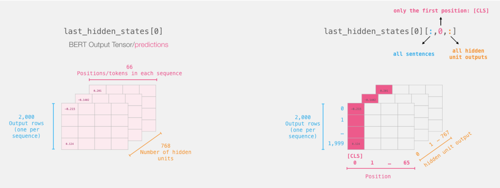

# Fine-tuning Bio_ClinicalBERT for Early Readmission Prediction on MIMIC Data

## Overview

This project utilizes Bio_ClinicalBERT, a pre-trained clinical language model developed by Emily Alsentzer and available on Hugging Face, for the task of early hospital readmission prediction on MIMIC data. The model is fine-tuned specifically for predicting readmissions within 3 days. The extracted CLS embeddings from the model's output are used as features for training a logistic regression model.

## Table of Contents
- [Introduction](#introduction)
- [Quick Start](#quick-start)
- [Usage](#usage)
- [Fine-tuning](#fine-tuning)
- [Results](#results)

## Introduction

BioClinicalBERT is a powerful pre-trained clinical language model designed for various NLP tasks in the medical domain. This project fine-tunes BioClinicalBERT on the MIMIC dataset, a freely accessible critical care database, to predict early hospital readmissions.

## Quick Start

Follow these steps to quickly set up and run the project:

1. **Clone the repository:**

   ```bash
   git clone https://github.com/bhumikasrc/HuggingFace_MIMIC.git
   cd HuggingFace_MIMIC

2. **Install Dependencies:**

    ```bash
    pip install -r requirements.txt

3. **Download MIMIC Data**:
    The MIMIC-III dataset is a large dataset of de-identified health records of ICU patients. The dataset is available at https://mimic.physionet.org/.


## Usage

Explore and customize the project based on your specific use case. The main jupyter notebook performs early readmission prediction using **Bio_ClinicalBERT** and demonstrates how to utilize the trained **Bio_ClinicalBERT** model checkpoint for downstream tasks, specifically classification using the `CLS` embedding.

<p align="center">
  <kbd></img></kbd>
</p>
<p align="center"><em>Image Credits:<a href="https://jalammar.github.io/a-visual-guide-to-using-bert-for-the-first-time/"> A Visual Guide to Using BERT for the First Time - Jay Alammar</a></em></p>

## Fine-tuning

To run the training script with custom hyperparameters, modify the `TrainingArguments` instance in the script:

```python
args = TrainingArguments(
    output_dir="train_checkpoint",
    evaluation_strategy="steps",
    eval_steps=500,
    save_steps=500,
    logging_steps=500,
    per_device_train_batch_size=8,
    per_device_eval_batch_size=8,
    num_train_epochs=3,
    seed=0,
    load_best_model_at_end=True,
)
```

## Results

## Results

After training BioClinicalBERT on the MIMIC dataset for early hospital readmission prediction, the model achieved the following performance metrics:

**Accuracy:** 67%

These results demonstrate the effectiveness of the fine-tuned BioClinicalBERT model in predicting early hospital readmissions within a 3-day window. The achieved accuracy of 67% indicates the model's capability to make correct predictions on the test set.
